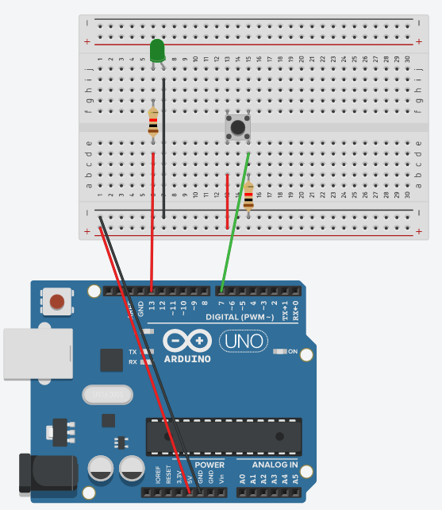

## :computer: Introduzione

Aggiungere un pulsante al proprio progetto Arduino può sembrare la cosa più semplice da realizzare, ma se al posto di un pulsante si vuole realizzare un interruttore la cosa si fa leggermente più complicata. In questo articolo parliamo della funzione di anti-rimbalzo da applicare per ottenere un interruttore.
Un pulsante è un contatto Normalmente Aperto (N.O.) che è aperto a riposo e nel momento in cui viene premuto chiude il circuito permettendo alla corrente di scorrere sul circuito.
Nella teoria un pulsante apre e chiude istantaneamente il circuito ma nella realtà esiste un piccolo transitorio

Se usiamo il pulsante quando è premuto per accendere una lampada e quando lo rilasciamo vogliamo che la lampada si spenga siamo nel caso in un utilizzo monostabile, ed in questo caso il fenomeno di microbalzo del pulsante è trascurabile. Se invece vogliamo che il pulsante si comporti come un interruttore che alla prima pressione accenda il led e alla seconda pressione lo spenga allora siamo di fronte ad un caso di utilizzo bistabile ed in questo caso dovremmo armarci di una funzione di antirimbalzo per garantire uno stato stabile di accensione o spegnimento del led comandato.

## Circuito

Il circuito per realizzare un pulsante bistabile con Arduino è riportato qui sotto. Le resistenze sono state messe per garantire che il LED non si bruciasse come detto nei primi articoli sui LED.



## Funzione di anti-rimbalzo

Per poter controllare in maniera efficace lo stato del pulsante l'idea di base è quella di mettere un semaforo a codice e di salvare lo stato del pulsante solo nel caso sia passato un tempo adeguato per poter garantire che sia terminato il periodo del microbalzo del pulsante.

Andiamo a leggere il valore del pulsante e lo confrontiamo con una guardia, se il valore cambia allora ci predisponiamo ad attendere un tempo adeguato prima di aggiornare lo stato del LED e di pilotarlo dall'uscita digitale agganciata.

Il cuore del codice lo riporto qui sotto:

```c
int buttonValue = digitalRead(BUTTON_PIN); // leggiamo lo stato del pulsante
if(buttonValue != lastButtonValue){ // se lo stato del pin è variato
    debounceTime = millis(); // tengo in memoria l'orario del cambio di stato del pulsante
}

if((millis() - debounceTime) > WAIT_FOR_DEBOUNCE){ // se è passato un tempo minimo dall'ultimo cambio di stato
    if(buttonValue != buttonStatus && buttonValue == HIGH){ // se il pin del pulsante ha un valore diverso dalla variabile di stato
        ledStatus = !ledStatus; // cambio lo stato del led
        digitalWrite(LED_PIN, ledStatus);
    }
    buttonStatus = buttonValue; // assegno lo stato del pulsante con il nuovo valore
}
lastButtonValue = buttonValue; // assegno all'ultimo valore del pulsante lo stato
delay(10); // ritardo
```

se volete il progetto intero è disponibile sul mio repository github qui: [https://github.com/capitanfuturo/arduinoSalad/blob/master/005_button_debounce_led/005_button_debounce_led.ino](https://github.com/capitanfuturo/arduinoSalad/blob/master/005_button_debounce_led/005_button_debounce_led.ino).

## Considerazioni

Questo esercizio mi ha fatto capire come a differenza della programmazione ad alto livello, quando si ha a che fare con componenti fisici a basso livello, il programmatore debba tenere conto degli aspetti tecnici e di latenza di alcuni componenti analogici.
In un software non ci si immaginerebbe mai di aggiungere dei delay perchè concorrenza e schedulazione sono gestiti a livelli più bassi. Con Arduino invece, e con componenti analogici la lettura delle schede tecniche di ogni singolo componente, anche del semplice pulsante sono necessasri per il corretto funzionamento del progetto.


> Il Buddha, il Divino, dimora nel circuito di un calcolatore o negli ingranaggi del cambio di una moto con lo stesso agio che in cima a una montagna o nei petali di un fiore. (Carl Gustav Jung)
