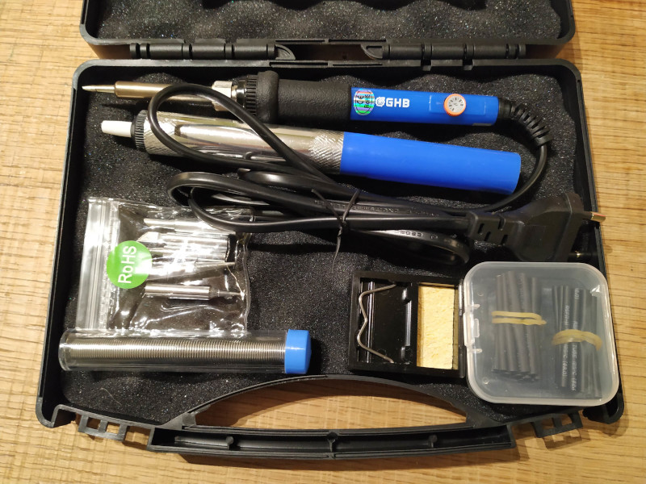
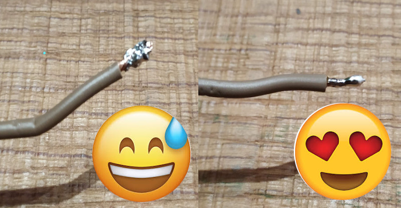

## :wrench: Premessa

Uno degli obiettivi di quest'anno è iniziare a fare pratica con il saldatore a stagno ed in questo un componente per Arduino contenuto nel KIT comprato a inizio anno mi ha dato l'occasione per cimentarmi in questa avventura.
Ho sempre visto come un limite per i piccoli lavori DIY, ma anche per un informatico non sapere mettere in pratica alcune basi di elettronica imparate all'università per mancanza di pratica con lo stagnatore, il voltmetro e altri strumenti di elettronica di base.
Quest'anno ho quindi deciso di fissarlo come obiettivo per non rimandare ulteriormente questo incontro con l'hardware... quello bello.

## Materiale utile per imparare

Uno dei canali che seguo su YouTube tra le mie iscrizioni è quello di Daniele Tartaglia. Daniele è un ottimo maker ed oltre a consigliare prodotti per neofiti realizza dei progetti veramente interessanti e accessibili anche a chi non mastica troppo di elettronica.
[Daniele Tartaglia, Corso di saldatura](https://www.youtube.com/watch?v=bGw4YCoaZxI&t=669s) è un video must, per la chiarezza espositiva e per la qualità.

## Cosa serve per iniziare

Dato l'uso saltuario, ho scelto di orientarmi su un semplice saldatore a stilo. Ho cercato il modello consigliato proprio da Daniele, ma a al posto di comprarlo su Bangood ne ho trovato uno su Amazon a questo indirizzo: [GHB Saldatore 60W 10-in-1 Kit di Saldatura](https://www.amazon.it/gp/product/B01MD0O47P/ref=ppx_yo_dt_b_asin_title_o01_s00?ie=UTF8&psc=1) perchè completo di tutto e in una pratica valigetta.

Conoscendomi poi ho optato per un ulteriore acquisto. Sempre su Amazon ho trovato questo [Fixpoint Sostegno Per Saldatura con Lente E Supporto](https://www.amazon.it/gp/product/B000LB84M4/ref=ppx_yo_dt_b_asin_title_o09_s00?ie=UTF8&psc=1). Questo oggetto soprattutto se si vuole saldare su componenti elettronici è molto utile e permette di non preoccuparsi di tenere in mano la scheda da saldare.

Altri aspetti da tenere presente sono:

- Scegliere un ambiente arieggiato. Il fumo del metallo fuso è nocivo.
- Usare un tavolo che non sia alla portata dei bambini. La punta del saldatore scalda molto ed è meglio posizionarlo sempre nel suo alloggiamento per non incorrere in scottature.
- In relazione al punto precedente se non avete un tavolo da lavoro ed utilizzate come me il tavolo della cucina provvedere a delle tovaglie spesse per non bruciare il tavolo.
- Fate esercizio prima di lanciarvi su cose complicate, certi componenti si possono rovinare se scaldati troppo.

## La mia prima esperienza

Come prima esperienza mi sono cimentato in un semplice saldatura di un cavo elettrico spellato e se devo essere sincero... non è stato così facile come sembrava.
Ho provato ad usare la punta più piccola pensando di fare cosa giusta ed invece come consigliato dal video è meglio partire dalla punta piatta e far scorrere il metallo da saldatura sulla punta.

Dopo alcuni tentativi i risultati si sono iniziati a vedere.

Terminate le prove su poveri cavi spellati mi sono cimentato nella saldatura di una piedinatura su un display LCD 16x2 da usare in accoppiata con una breadboard ed un Arduino UNO 3.

## Conclusione

Era dai tempi dell'univeristà, e ormai sono passati 14 anni, da quando avrei voluto iniziare ad imparare a saldare e finalmente ci sono riuscito.
Sono contento di questo obiettivo raggiunto ed inoltre questo mi apre la strada a nuovi progetti con Arduino e RaspberryPi.
Se volete inziare a saldare ultimamente c'è molto materiale su YouTube e con un pò di teoria e pratica si possono iniziare a fare piccole riparazioni e progetti personali.
In conclusione è divertente e con un pò di pratica si riesce fin da subito ad ottenere dei risultati soddisfacenti.

> Possiamo vivere nel mondo una vita meravigliosa se sappiamo lavorare e amare, lavorare per coloro che amiamo e amare ciò per cui lavoriamo. (Lev Tolstoj)
