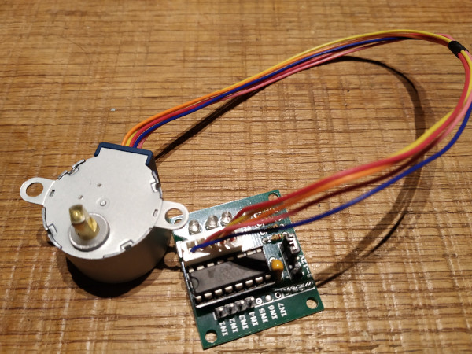

## :computer: Premessa

Nella scatola degli attrezzi di chiunque si voglia cimentare con il [Physical Computing](https://en.wikipedia.org/wiki/Physical_computing) non possono mancare i motori stepper e servo. Fortunatamente Arduino IDE porta già con se delle librerie pronte per utilizzare questi strumenti che permettono di dare vita ai propri progetti elettronici.
Sto ancora decindendo come poter utilizzare in maniera profiqua quetsi oggetti e mi sto orientando sempre di più ad un'interazione con il sistema dei mattoncini LEGO. In fondo lascerò qualche spunto che magari mi tornerà utile in futuro.

## Differenza servo-motore - motore passo-passo (stepper)

Ho letto diversi articoli sulla differenza tra servo motore e motore passo passo ma nell'utilizzo con progetti arduino la differenza è davvero minima in termini di prestazioni mentre cambia significativamente il caso d'uso di impiego.
Entrambi i motori sono precisi e garantiscono la qualità sull'angolo imposto all'asse.

### Calcolo della posizione

La maggior differenza si ha sul per il motore passo passo si può sapere la posizione meccanica a partire dal numero di passi che impiega il motore per compiere una rotazione di 360 gradi e contando quanti passi ha fatto, la rotazione viene quindi calcolata da questi due dati.
Nel servo motore invece è possibile impostare l'angolo di posizione in modo assoluto e non relativo come per lo stepper.

### Angolo di rotazione

La più grande differenza nei casi s'uso con Arduino è data dal fatto che i servo motori tipicamente hanno un'escursione di 180 gradi mentre i motori stepper possono compiere tranquillamente i 360 gradi di rotazione.

### Link

- [Motore Stepper](https://it.wikipedia.org/wiki/Motore_passo-passo)
- [Servomotore](https://it.wikipedia.org/wiki/Servomotore)

## Il micro servo motore Tower PRO SG90

Il motore SG90 può essere utilizzato facilmente con un Arduino grazie alla libreria Servo che permette di impostare l'angolo voluto sul motore con un semplice comando. Da ricordare che questo motore molto leggero permette rotazioni fino a 180 gradi. 90 da un lato e 90 dall'altro.
Ha un'elevata coppia in uscita 1,8 Kg/cm ed è tra i più usati per la costruzione di robot con Arduino.
E' caratterizzato da 3 PIN: Vcc, Gnd e PWM (pulse width modulation che permette di avere segnali che simulano l'analogico su un canale digitale).


Lo schema e il codice è quindi davvero molto semplice. In questo esempio ho collegato il PIN PWM con il PIN 9 di Arduino.

```c
/*
 * MIT License - Copyright (c) 2020 Giuseppe Caliendo
 *
 * Utilizzo di un servo motore Tower Pro SG90 con l'ausilio della libreria
 * standard Servo.
 */
#include <Servo.h>

const unsigned int SERVO_PIN = 9; // pin di comando del servo motore

Servo servo;

void setup() {
  servo.attach(SERVO_PIN);
  servo.write(0); // porto in posizione iniziale il servo motore
  delay(1000);
}

void loop() {
  // ruoto in un senso
  for(int angle = 0; angle < 180; angle++){
    servo.write(angle);
    delay(10);
  }
  // ruoto nel senso opposto
  for(int angle = 180; angle > 0; angle--){
    servo.write(angle);
    delay(10);
  }

}
```

### Variante con potenziometro


```c
/*
 * MIT License - Copyright (c) 2020 Giuseppe Caliendo
 *
 * Utilizzo di un servo motore Tower Pro SG90 guidato da un potenziometro
 * con l'ausilio della libreria standard Servo.
 */
#include <Servo.h>

const unsigned int SERVO_PIN = 9; // pin di comando del servo motore
const unsigned int POT_PIN = 0; // pin di letture del potenziometrp

Servo servo;
int potVal; // valore del potenziometro
int servoVal; // valore da inviare al servo motore

void setup() {
  servo.attach(SERVO_PIN);
  servo.write(0); // porto in posizione iniziale il servo motore
  delay(2000);
}

void loop() {
  potVal = analogRead(POT_PIN); // leggo il valore de lpotenziomentro tra 0 e 1023
  servoVal = map(potVal, 0, 1023, 0, 180); // mappa il valore su uno nuovo tra 0 e 180
  servo.write(servoVal); // invio il valore al servo motore
  delay(15);
}
```

il codice sorgente è disponibile [qui](https://github.com/capitanfuturo/arduinoSalad/blob/master/009_servo_sg90/009_servo_sg90_potenziometro.ino).

### Link utili per servo motori

- Produttore Tower PRO: [http://www.towerpro.com.tw/product/sg90-7/](http://www.towerpro.com.tw/product/sg90-7/)
- Video base: [https://www.youtube.com/watch?v=SfmHNb5QAzc](https://www.youtube.com/watch?v=SfmHNb5QAzc)
- Pilotare più motori: [https://www.youtube.com/watch?v=TkA2LJctU1c](https://www.youtube.com/watch?v=TkA2LJctU1c)
- Reference: [https://www.arduino.cc/en/Reference/Servo](https://www.arduino.cc/en/Reference/Servo)

### Integrazione con sistema Lego per servo motori

- [https://www.instructables.com/id/Servo-motor-Adapted-to-Lego](https://www.instructables.com/id/Servo-motor-Adapted-to-Lego)

## Il motore stepper 28BYJ-48 con scheda driver ULN2003

Il motore passo-passo 28BYJ-48 viene solitamente venduto con una scheda driver ULN2003 che ne permette l'utilizzo con la libreria standard di Arduino Stepper.h.
4 PIN pilotano il motore e altri due ne portano la corrente a 5V e la messa a terra.



```c
/*
 * MIT License - Copyright (c) 2020 Giuseppe Caliendo
 *
 * Utilizzo di un motore passo passo 28BYJ-48 + scheda driver
 * ULN2003 con l'ausilio della libreria standard Stepper.
 */
#include <Stepper.h>

static const int STEPS_PER_REVOLUTION     = 24 * 64;
static const int PIN_IN1_BLUE             = 8;
static const int PIN_IN2_PINK             = 9;
static const int PIN_IN3_YELLOW           = 10;
static const int PIN_IN4_ORANGE           = 11;

Stepper myStepper(STEPS_PER_REVOLUTION, PIN_IN1_BLUE, PIN_IN3_YELLOW, PIN_IN2_PINK, PIN_IN4_ORANGE);


void setup() {
  myStepper.setSpeed(6.5); // in rpm rotazioni per minuto
}

void loop() {
  myStepper.step(STEPS_PER_REVOLUTION);   // clockwise
  delay(100);
  myStepper.step(-STEPS_PER_REVOLUTION);  // counter-clockwise
  delay(1000);
}
```

### Link utili per motori stepper

- Video base: [https://www.youtube.com/watch?v=B86nqDRskVU](https://www.youtube.com/watch?v=B86nqDRskVU)
- Uso senza libreria: [https://www.youtube.com/watch?v=avrdDZD7qEQ](https://www.youtube.com/watch?v=avrdDZD7qEQ)

### Integrazione con sistema Lego per motori stepper

- [https://www.instructables.com/id/Servo-SG90-With-Unmodified-Lego/](https://www.instructables.com/id/Servo-SG90-With-Unmodified-Lego/)

## Esempi dal mio repository ArduinoSalad

1. [https://github.com/capitanfuturo/arduinoSalad/tree/master/009_servo_sg90](https://github.com/capitanfuturo/arduinoSalad/tree/master/009_servo_sg90).
2. [https://github.com/capitanfuturo/arduinoSalad/tree/master/010_stepper_28BYJ-48](https://github.com/capitanfuturo/arduinoSalad/tree/master/010_stepper_28BYJ-48).
