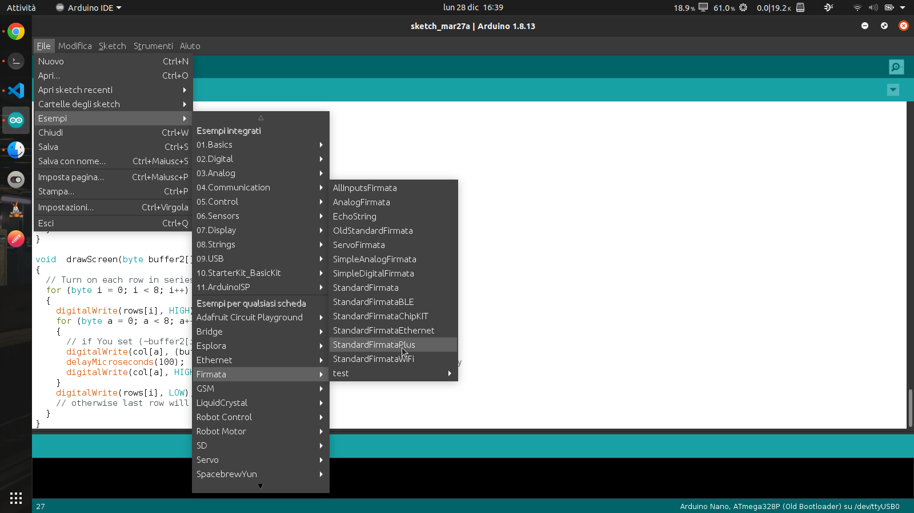
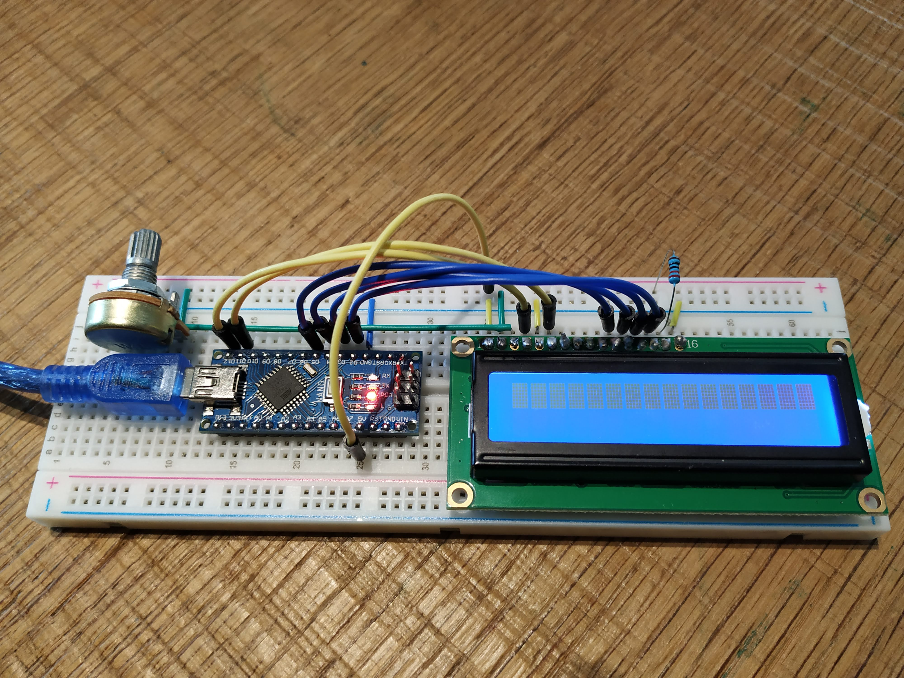

## :computer: Premessa

Tra gli obiettivi di questo 2021 c'è quello di perfezionare l'uso di NodeJS e di riflesso Javascript e allora quale migliore modo per fondere quanto imparato l'anno scorso con Arduino insieme a Node?

Arduino è una piattaforma di prototipizzazione elettronica che permette di pilotare componenti elettronici con linguaggio [Wiring](https://it.wikipedia.org/wiki/Wiring) derivato dal C/C++. Ciò lo rende facile da approcciare anche per chi come me ha per lo più masticato Java e affini. NodeJS invece è un runtime Javascript che permette di scrivere codice javascript da far eseguire ad un motore JS V8, famoso per essere il core del browser di Google, Chrome.

## Johnny Five JS

Uno dei progetti più interessanti che ho trovato per mettere insieme i due mondi è [Johnny Five](http://johnny-five.io/). Basato su Node è una piattaforma per IoT e robotics. E' stato rilasciato da Bocoup nel 2012 e nonostante gli anni è ancora una buona libreria.
L'utilizzo è abbastanza semplice come descriverò in seguito.

### Prerequisiti

Ho voluto provare questa libreria con un arduino nano, questo perchè per la costruizione di uno dei miei progetti più lunghi: [spritzino](https://github.com/capitanfuturo/spritzino) avevo comprato un bundle di 3 arduino nano. Oltre ad arduino servirà un PC con:

1. Node.js e npm installato
2. Arduino IDE per installare nell'arduino il firmaware [firmata](https://www.arduino.cc/en/reference/firmata)
3. Un code editor. Io utilizzo VSCode.

### Installazione

Dopo aver installato Node ho aperto Arduino IDE. Nel mio caso ho selezionato come dispositivo da Strumenti -> Scheda Arduino Nano e come Processore _ATmega328P (Old Bootloader)_.

Collegato L'arduino con la porta USB del PC ho caricato il firmware firmata come da schermata qui sotto:



A questo punto non manca che aprire VSCode da console su un progetto nuovo:

```bash
mkdir johnny
cd johnny
npm install --save johnny-five
code .
```

Per provare subito a utilizzare johnny-five si crea un file javascript da far eseguire a node. L'oggetto principale è Board. Riporto qui uno snippet che fa lampeggiare il LED integrato in Arduino:

```js
const { Board, Led } = require("johnny-five")
const board = new Board()

board.on("ready", () => {
  const led = new Led(13)
  led.blink()
})
```

## Progetto: stazione metereologica

Per rendere la cosa più interessante ho provato a mettere in piedi un programma Node che ad ogni ora vada ad interrogare una API pubblica e che ne visualizzi il risultato su uno schermo LCD 16x2. Ho rispolverato un progetto che trovate [qui](../2020-04-15-arduino-display-1602A), mentre per l'API ho scelto [openweathermap](https://openweathermap.org/) che mette a disposizione previa iscrizione delle API metereologiche gratuitamente.

Riporto tutto di seguito e in fondo i link principali.

### Cablaggio

| PIN Display | Descrizione                                                        | PIN Arduino                                   |
| ----------- | ------------------------------------------------------------------ | --------------------------------------------- |
| VSS         | GND, massa del display                                             | collegato al polo -                           |
| VDD         | 5V, alimentazione del display                                      | collegato al polo +                           |
| V0          | controllo del contrasto                                            | collegato al potenziometro                    |
| RS          | 0 per invio comando, 1 per invio dati                              | PIN 12                                        |
| RW          | 0 per scrittura dati / comandi, 1 per lettura dati / stato display | collegato al polo -                           |
| E           | inizia il ciclo di lettura / scrittura                             | PIN 11                                        |
| D0          | Bus dati per comunicazioni 8bit                                    |                                               |
| D1          | Bus dati per comunicazioni 8bit                                    |                                               |
| D2          | Bus dati per comunicazioni 8bit                                    |                                               |
| D3          | Bus dati per comunicazioni 8bit                                    |                                               |
| D4          | Bus dati per comunicazioni 8 o 4bit                                | PIN 5                                         |
| D5          | Bus dati per comunicazioni 8 o 4bit                                | PIN 4                                         |
| D6          | Bus dati per comunicazioni 8 o 4bit                                | PIN 3                                         |
| D7          | Bus dati per comunicazioni 8 o 4bit                                | PIN 2                                         |
| A           | 5V, alimentazione della retroilluminazione                         | collegato al polo + con resistenza da 220 Ohm |
| K           | GND, massa della retroilluminazione                                | collegato al polo -                           |

### Risultato



### Codice sorgente

```js
require("dotenv").config()
const { LCD, Board } = require("johnny-five")
const got = require("got")

const RS = process.env.RS | 12
const EN = process.env.EN | 11
const DB4 = process.env.DB4 | 5
const DB5 = process.env.DB5 | 4
const DB6 = process.env.DB7 | 3
const DB7 = process.env.DB8 | 2
const PORT = process.env.PORT | 3000
const API_KEY = process.env.API_KEY
const CITY = process.env.CITY
const COUNTRY = process.env.COUNTRY
const API_URL = "http://api.openweathermap.org/data/2.5/weather"
const REFRESH = 1000 * 60 * 60 // 1000 millisec * 60 sec * 60 min

const board = new Board()
let lcd

async function getWeather() {
  const { body } = await got(API_URL, {
    searchParams: {
      q: `${CITY},${COUNTRY}`,
      units: "metric",
      lang: "it",
      APPID: API_KEY,
    },
  })
  board.log("API", body)
  writeWeather(JSON.parse(body))
  return body
}

function writeWeather(weather) {
  const temp = weather.main.temp
  const humidity = weather.main.humidity
  const windSpeed = weather.wind.speed
  const windDegree = weather.wind.deg
  lcd.cursor(0, 0).print(`T:${temp}C h:${humidity}% `).print(":smile:")
  lcd
    .cursor(1, 0)
    .print(`w:${windSpeed}m/s `)
    .print(`${windDegree}`)
    .print(":arrowne:")
}

function onReady() {
  lcd = new LCD({
    pins: [RS, EN, DB4, DB5, DB6, DB7],
    rows: 2,
    cols: 16,
  })

  lcd.useChar("arrowne")
  lcd.useChar("smile")

  lcd.clear()
  getWeather()

  board.loop(REFRESH, () => {
    getWeather()
  })
}

board.on("ready", onReady)
```

## Conclusioni

L'integrazione tra Arduino e Node è interessante e può aprire la strada a diversi sviluppi. Per esempio si potrebbe usare express.js per mettere in piedi un server che esponga delle API e che possa quindi far pilotare da remoto un dispositivo costruito da noi.

L'idea è quella di portare a lavoro il tutto e vedere se riuscirò ad integrare questo progetto nel workflow quotidiano. Per esempio potrei potrei interrogare JIRA e avere sempre sotto occhio quante issue devo sistemare... :sweat_smile:.

## Link

- [Johnny Five API](http://johnny-five.io/api/)
- [openweathermap free API](https://openweathermap.org/)
- [Example from my repo](https://github.com/capitanfuturo/arduinoSalad/tree/master/013_J5_node_arduino_nano)

> "La pazienza, la perseveranza e il sudato lavoro creano un'imbattibile combinazione per il successo.". (Napoleon Hill)
