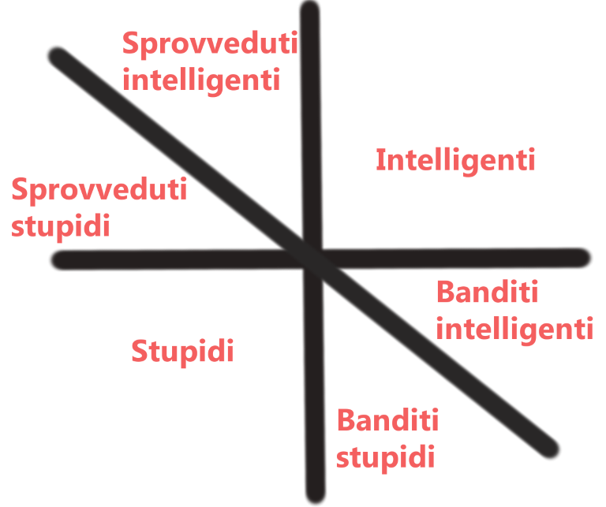

## 📚 Introduzione

Ho letto questo libro di Carlo Cipolla “The basic laws of human stupidity” da un consiglio di uno youtuber, Marcello Ascani. Un ragazzo che sta costruendo un discreto successo attraverso youtube e la sua presenza nei social.

Il libro è interessante anche se devo ammettere a volte privo di numeri scientifici però efficace nel descrivere seppur in modo forse troppo generalista l’essere umano e la sua tendenza a comportarsi da stupido.

## 📑 Leggi basilari e annotazioni

- Il numero di stupidi è sottostimato.
- Questo numero è indipendente dalla tipologia di gruppo di persone preso in considerazione.
- Le persone possono essere catalogate in sprovveduti, intelligenti, banditi e stupidi.
- Le persone non sono coerenti e si comportano tendenzialmente da intelligenti, banditi o sprovveduti. Solo gli stupidi tendono a comportarsi sempre come tali.
- I banditi perfetti sono molto pochi
- Le persone non-stupide sottovalutano troppo le conseguenze della presenza di persone stupide

## 🔢 Le 4 categorie del genere umano

Cipolla espone un grafico che riassume il suo pesniero e che si basa sul fatto che ognuno di noi è in equilibrio con gli altri. Ogni azione o non azione nostra fa conseguire una perdita o un guadagno ad un altro. Questo gioco però non è a somma zero e per questo si possono delineare delle aree, in particolare 4 quadranti che possono essere disposti su un piano cartesiano:

1. Gli sprovveduti
2. Gli intelligenti
3. I banditi
4. Gli stupidi

L’immagine che segue rappresenta lo schema:

Guardandolo si possono fare delle considerazioni interessanti. Per esempio possiamo individuare come intelligenti quelle persone che riescono ad ottenere con le proprie azioni un vantaggio per sè e per gli altri. Viceversa coloro i quali portano uno svantaggio per se e per gli altri si possono definire stupidi. Sono stupidi anche coloro che traggono vantaggio per sè a scapito di altri, quindi banditi ma nel momento che il vantaggio non è superiore allo svantaggio recato si possono ancora considerare stupidi. In alto a sinistra invece troviamo in generale gli spovveduti.

## 🍷 Conclusione

Libro piacevole e veloce. Una chicca è che l’autore italiano ha deciso di tradurre questo libro solo 25 anni dopo la sua prima edizione con il titolo "Allegro ma non troppo".

Non credo che si possa semplificare così tanto le persone però lo spirito del libro è leggero ed è chiaro che anche l’autore lo sappia. Parte centrale è lo schema sul piano cartesiano delle 4 categorie e il concetto antico ma sempre valido che ad ogni azione, ne corrisponde una controazione.

Altra considerazione è che leggendo il libro si possa credere troppo facilmente di non appartenere alla categoria incriminata ma posso assicurare che se ci si basa sulla regola del massimizzare il vantagio reciproco tipico degli intelligenti… beh allora è molto facile allontanarsi dalla categoria degli intelligenti per posizionarsi nel quadrante in basso a destra.

In ogni caso se tenuto a mente lo schema di Cipolla può aiutarci a riflettere sulle nostre azioni prima di compierle. Un breve sguardo mentale al quadrante per provare a capire dove ci stiamo posizionando ci dà una misura di dove vogliamo andare e cosa vogliamo essere.

## 🤓 Riferimento

Carlo M. Cipolla, _The basic laws of human stupidity_, Il Mulino, 3 novembre 2011. [Amazon](https://www.amazon.it/basic-laws-human-stupidity/dp/8815233814)

> "A stupid person is the most dangerous type of person" (Carlo Cipolla)
