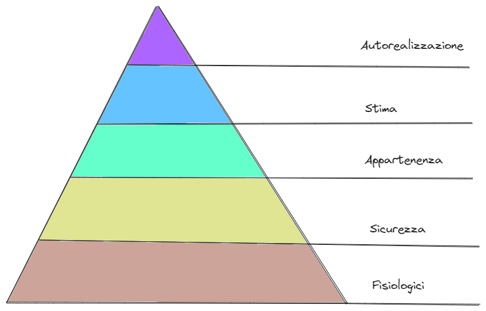

## 📚 Introduzione

Da quasi un anno ho avuto la fortuna di iniziare un percorso professionale di leadership che mi ha portato anche a cambiare azienda e spingermi in una nuova avventura professionale. Credo che alla basa di questo processo ci debba essere l'acquisizione continua di competenze e uno dei canali che più mi aiutano sono la lettura di testi specifici.
Questo libro è uno di quelli che uniscono sia aspetti pratici che teorici. L'autore parte dal primo giorno in azienda come manager e guida il lettore passo passo nelle attività che possono aiutare per costruire e alimnentare il team di lavoro.

Come dice l'autore, ad ingegneria infomratica ci hanno insegnato a gestire codice, architetture e computers ma non le persone. Purtroppo però i computer non scrivono software di qualità, almeno fintanto che l'AI non ci supererà. Per farlo sono necessarie le persone ed in particolare persone di qualità.

## 🚀 Cosa mi porto a casa da questa lettura

Il manager o meglio il leader ha una funzione importantissima perchè ha la possibilità di costruire le condizioni affinchè gli altri possano aver successo, imparare, sentirsi psicologicamente al sicuro e quindi dar spazio alla creatività e al meglio di sè. Il management è l'insieme del metodo e degli strumenti che si usano per eseguire il lavoro del manager.

### Snapshot

La prima cosa da fare quando si entra in azienda con il ruolo di manager è quello di costruire uno snapshot. Questo assessment permetterà poi di avere una baseline dalla quale partire. I tre punti di vista sono:

1. **osservazione personale**
2. **osservazione dei manager**
3. **osservazione del team**

#### Presentati al team

- Per ogni componente dello staff organizza un incontro di 30 minuti e rendilo ricorrente. Sarà alla base dei successivi 1-1
- Fatti raccontare qual è la responsabilità del team e su cosa sta lavorando. Cosa piace loro del team e cosa c'è da migliorare: Come sta andando la tua settimana? Di che cosa ti stai occupando? Qual è l'ultima cosa di cui sei fiero che ha fatto il tuo team?
- Ringrazia, condividi che cosa ti sei annotato e fissa il prossimo incontro in maniera ricorrente e di 1 ora. Prenota una sala e concorda qual è il momento migliore per il tuo collega per avere questo incontro
- Introduciti ai manager e in maniera proattiva fissa un incontro con loro. Fatti raccontare l'opinione che hanno del team, le performance e il dettaglio dei singoli. Da quanto tempo sono in azienda e qual è il modo migliore per lavorare con loro.

Crea a questo punto uno **snapshot** in modo da ottenere **allineamento sulle osservazioni** tue, dei manager e del team. Potrebbe capitare che ci sia poca comunicazione dai manager verso il team o viceversa, così come false credenze.

- Qualsiasi problema di comunicazione dal team verso i manager va discussa con il team
- Qualsiasi problema di comunicazione dai manager verso i team va discussa con i manager

### Organizza il tuo tempo

L'obiettivo è quello di mantenere poche informazioni e non dimneticare nulla. Categorizzare le attività e misurare gli output. I tre strumenti principali sono:

- **Calendario**: reccoglie quello che stai facendo con il tuo tempo. Usalo solo per organizzare il tuo tempo e non le attività da fare. Metti a calendario solo: **meeting e attività che indicano che sei occupato** in modo da riservare dei blocchi per le tue attività su cui vuoi avere il pieno focus. Ricorda di **usare i reminders**.
- **Todo list**: è l'unico posto dove vivono le attività. Sfrutta le funzionalità di attività ricorrenti. Andy Grove, fondatore e CEO di Intel organizzava le attività manageriali in 4 categorie:
  - Information gathering
  - Decision-making
  - Nudging
  - Being a role model
- **Email**: è la principale fonte dei tuoi messaggi in ingresso. Chat o altro va considerato come secondario:
  - **Archivia tutto quello che è fatto**
  - **Non cancellare mai nulla**
  - **Imposta delle regole**.

### Comunicazione

Questo tema è sempre cruciale nei rapporti con le persone e l'autore da alcuni consigli utili:

- Se sei alterato comunicalo al tuo interlocutore e se puoi sposta quell'attività
- Comunica quando c'è bisogno non quando si vuole
- Non comunicare gossip ma cose certe
- Cerca sempre di far parlare l'altro, tu sei un facilitatore
- Rispetta il modo con l'altro vuole comunicare
- Sii coerente con il tuo ruolo
- Sii capace di ocmunicare i feeedback
- Evita l'overcommunication e i fronzoli

### Delegare

La delega è un trasferimento di assegnamento di un task. La delega però non trasferisce la responsabilità del task che rimane al manager. Per questo motivo ci deve essere il giusto equilibrio tra controllo e fiducia nei confronti del collega delegato.
Non si può essere un buon manager senza saper delegare in maniera efficace e senza mantenerne la responsabilità.
Ogni settimana, prenditi 30 minuti per fare un **recap delle attività** in cui tu e il team è coinvolto, come ti senti e che decisioni hai preso a riguardo. registra i **progressi**, i **problemi** evidenziati e la **pianificazione**. Questo contentuto sarà il grooming dei prossimi 1-1

### Come organizzare i 1-1

- Devono essere **ricorrenti**, preferibilmente nello stesso orario e stessa modalità, stanza
- Bisogna costruire un'**agenda** da condividere e arrivare preparati
- Il primo 1-1 è importante e va gestito in maniera particolare attravero il **contracting**. Sono delle domande che permettono di settare degli obiettivi: In che area ritieni di avere più bisogno di supporto? Si possono non avere le idee chiare a riguardo ma tu sei disponibile per ascoltare il tuo collega. Come vorresti ricevere feeedback e plausi? Qauli comportamenti rendono difficile il lavoro insieme? Come faccio a capire se il mio supporto va nella direzione giusta? Che livello di confidenzialità hanno i nostri incontri?
- E' il meeting del proprio collega non tuo
- Il **silenzio** è d'oro e non è necessario riempirlo
- Gli aggiornamenti operativi non devono essere il core della discussione

#### Piramide dei bisogni di Maslow

Ricorda che come manager puoi andare a soddisfare un percorso verso l'alto della piramide dei bisogni di Maslow.

- bisogni fisiologici: alimentazione, respiro, sonno
- sicurezza: fisica, occupazione, sicurezza familiare, salute, patrimonio
- appartenenza: amicizia, relazioni, affetto
- stima: rispetto, realizzazione
- autorealizzazione: problem solving, creatività, accettazione, assenza di pregiudizi

Jean Piaget ritiene che si possa aaprendere meglio se il percorso è auto-determinato. Per questo come manager è bene costruire il percorso di crescita insieme. Non esiste solo il binario della crescita economica ma guardando anche la piramide di prima esiste anche il binario delle competenze che portano all'autorealizzazione.

## 🍷 Conclusione

## 🤓 Riferimento

James Stanier, _Become an Effective Software Engineering Manager_, Pragmatic Bookshelf, 2020. [Amazon](https://www.amazon.it/Become-Effective-Software-Engineering-Manager-ebook/dp/B08GF7P3G8/ref=tmm_kin_swatch_0?_encoding=UTF8&qid=1695987600&sr=8-2).

> "". ()
